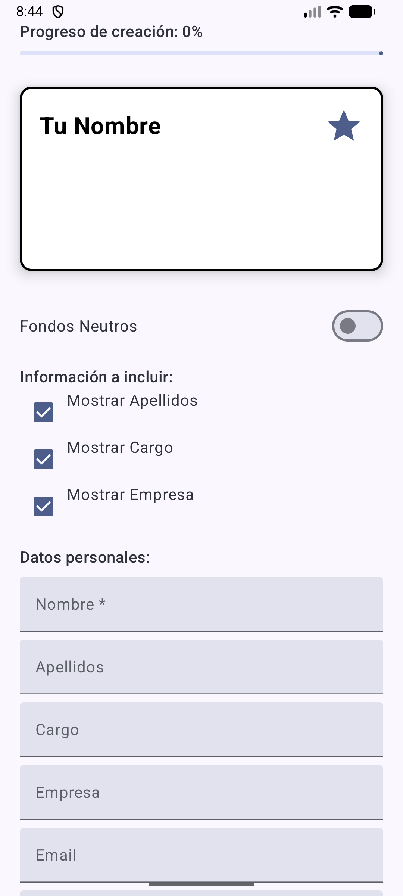

# Business Card App 📇

Aplicación Android desarrollada con Jetpack Compose que permite crear y personalizar tarjetas de presentación digitales de forma interactiva.

## 📱 Características

### Funcionalidades principales

- **Barra de progreso**: Muestra el porcentaje de completitud de la tarjeta basado en los campos completados
- **Vista previa en tiempo real**: Visualiza la tarjeta de presentación mientras la personalizas
- **Campos personalizables**: 
  - Nombre (obligatorio)
  - Apellidos
  - Cargo
  - Empresa
  - Email
  - Teléfono

### Opciones de personalización

- **Checkboxes**: Controla qué información se muestra en la tarjeta (Apellidos, Cargo, Empresa)
- **Switch de fondos**: Alterna entre fondos neutros (grises) y fondos coloridos (azul, naranja, verde, rosa)
- **Selector de fondo**: 4 opciones diferentes de fondo mediante FilterChips
- **TriStateCheckbox**: Ajusta el grosor del borde de la tarjeta (Sin borde / Medio / Grueso)
- **Selector de iconos**: Elige entre 4 iconos diferentes mediante RadioButtons:
  - ⭐ Estrella
  - 🏠 Casa
  - ❤️ Favorito
  - ⚙️ Configuración

## 📸 Captura de pantalla

## 🛠️ Tecnologías utilizadas

- **Kotlin**: Lenguaje de programación
- **Jetpack Compose**: Framework de UI declarativa
- **Material Design 3**: Sistema de diseño moderno
- **Android Studio**: IDE de desarrollo

## 👤 Autores

Alex Jiménez y Iván Vallejo